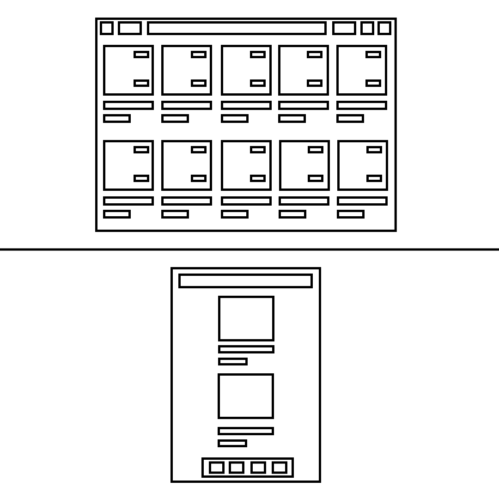

### Segundo Parcial Frontend-Development

##### Juan Pablo Alzate y Santiago Martínez

**Header:** En el header se encuentra un contenedor general, con 6 tipos de elementos distintos, siendo estos: el logo, los botones de selección de inicio, la barra de búsqueda, los botones de notificaciones y mensajes (que comparten el mismo tipo de elemento), la foto de perfil y el menú de opciones. Consideramos que cada elemento de estos es la pieza mínima que tendría un comportamiento distinto entre si, resaltando como casos especiales el logo y el menú de selección, los cuales están como elementos distintos para delimitar las márgenes fijas del contenedor. Cada elemento tiene un hover propio, generando una sombra detrás del objeto para remarcarlo.

**Mobile:** Al entrar a la pagina desde un dispositivo móvil, aparecen un header y un footer. En el header cada sección es su propio elemento, y en el footer cada botón distinto es su propio elemento.

**Pin:** Dentro del pin se distinguen 3 elementos, la imagen del pin, una descripción del pin y el nombre del autor del mismo. La imagen se encuentra dentro de un contenedor, el cual tiene dentro del mismo otro contenedor que se encuentra por encima de la imagen en el zIndex que contiene 

**PinHover:** Al pasar el ratón por encima de las imágenes se abre un menu dentro de un contenedor en el cual se encuentran tres botones en dos tipos, el primero en la esquina superior derecha, los otros en la esquina inferior derecha, estos dos comparten el mismo tipo de elemento. Cada uno de los botones reacciona a un hover.